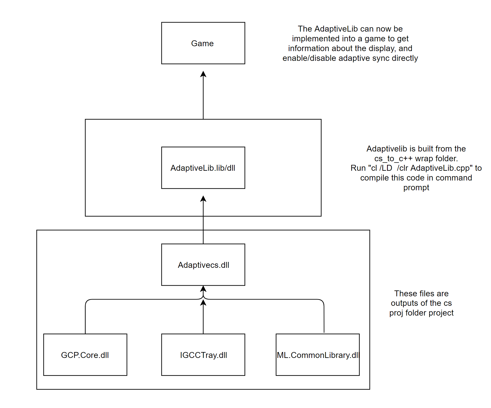

# Adaptive Sync Library

This project contains everything needed to build the Adaptive Sync library. This lirbary has the following functionality:
Query driver to see if adaptive sync is supported (AdaptiveSyncSupported())
Query driver to see if adaptive sync is currently enabled (IsAdaptiveSyncEnabled())
Tell driver to turn on the adaptive sync functionality (EnableAdaptiveSync())
Tell driver to turn off adaptive sync functionality (DisableAdaptiveSync)
Query driver to get maximum refresh rate supported by the screen (AdaptiveSyncMaxRefesh())
Query driver to get minimum refredsh rate supported by the screen (AdaptiveSyncMinRefresh())

Building the library:

Becasue the IGCC project is written in c#, this build should be done in two steps:
Build the GCP.Core.sln project located in "adaptive-sync-demo\AdaptiveSyncLib\cs proj\src". You may need to build in order ML.CommonLibrary->GCP.Core->GCP.DataAccessLibrary->GCP.ML.BackgroundSysTray->AdaptiveSyncFunctions
This will output files to "AdaptiveSyncLib\cs proj\src\AdaptiveSyncFuncitons\bin\x64\Release". The needed file here are "Adaptivecs.dll", GCP.Core.dll", "IGCCTray.dll", "ML.CommonLibrary.dll". This project also needs some files that can be retrieved with the nuget manager, these dlls are: "GalaSoft.mvvmLight.dll", "GalaSoft.MvvmLight.Platform.dll", "Newtonsoft.Json.dll", "Newtonsoft.Json.Schema.dll", "Serilog.dll", "Serilog.Sinks.File.dll".

Copy "Adaptivecs.dll" to "AdaptiveSyncLib\cs_to_c++ wrap\wrap". In a command promt, run "cl /LD /clr AdaptiveLib.cpp". This will produce "AdaptiveLib.lib" and "AdaptiveLib.dll" which can be called from a c++ application.

