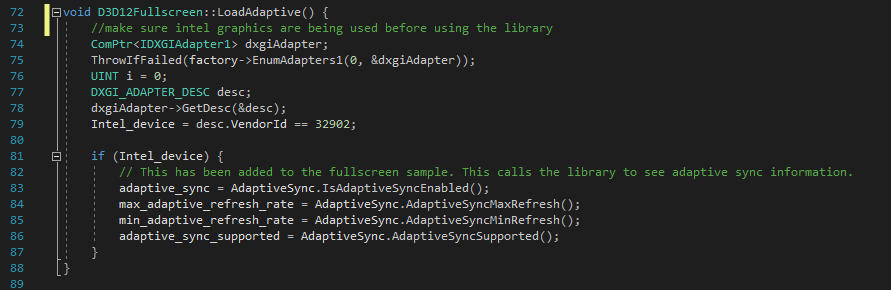

# DISCONTINUATION OF PROJECT #
This project will no longer be maintained by Intel.
Intel has ceased development and contributions including, but not limited to, maintenance, bug fixes, new releases, or updates, to this project.
Intel no longer accepts patches to this project.
# Adaptive Sync Demo

This project illustrates how to implement Intels Adaptive Sync capability in a Directx 12 application. More information can be found [here](https://software.intel.com/en-us/articles/enabling-intel-adaptive-sync-with-11th-generation-intel-processor-graphics-and-microsoft)

NOTE: The adaptive sync library is not needed in order to implement adaptive sync on Intel graphics. The library gives you extended access/information about the users configuration. This library allows a game to determine if the user has an adaptive sync display, enable/disable adaptive sync directly from C++, query to see if adaptive sync is currently enabled, and query to see the maxiumum and minimum refresh rate of the display. When using this libray, it's important to check to see if the machine is using Intel graphics as done in D3D12FullScreen.cpp:

It is recommended to build this library on a machine that has intel graphics.

To build this project, first download the Intel Graphics Command Center here:
https://www.microsoft.com/en-us/p/intel-graphics-command-center/9plfnlnt3g5g?activetab=pivot:regionofsystemrequirementstab

the .net frameworm 4.7.2 Developer Pack sdk also needs to be installed: https://dotnet.microsoft.com/download/dotnet-framework/net472

Having visual studio installed is required to build this project. Once the IGCC is installed, open "x64 Native Tools Command Prompt for Vs" command prompt for your version of visual studio.

Within the command prompt, nasssvigate to the root of the adaptive sync project folder and run "run.bat"

If this is successful, all dll's from the IGCC will be gathered and placed into the project. 

Once the command has finished, you can now run the demo located at "AdaptiveSync\AdaptiveSyncDemo\src\bin\x64\Release\D3D12Fullscreen.exe"

The complete adaptive sync library will be compiled into "AdaptiveSync\AdaptiveSyncLib\Complete Library" including all dll, lib, and header files to implement the library into your project.

Known working configurations:
Machine: Icelake
Visual Studio: 2019 Preview 

Troubleshooting:
1)
If after running run.bat, dll files do not apear within "adaptive-sync-demo\AdaptiveSyncLib\Complete Library":

It is possible that the location of Intel dll has changed. If this is the case, naviagat to "C:\Program Files\WindowsApps\" and search for GCP.Core.dll. This should be in a directory such as "AppUp.IntelGraphicsExperience_1.100.1725.0_x64__8j3eq9eme6ctt\" take note of the version number, open run.bat and modify the path within the .bat file if needed.
.

2)
If the final build in the run.bat file fails:
check the folder "AdaptiveSync/AdaptiveSyncLib/Complete Library" to make sure each of these files are present:
"Adaptivecs.dll"
"AdaptiveLib.dll"
"AdaptiveLib.lib"
"GalaSoft.MvvmLight.dll"
"GalaSoft.MvvmLight.Platform.dll"
"GCP.Core.dll"
"Header.h"
"IGCCTray.ece"
"ML.CommonLibrary.dll"
"Newtonsoft.Json.dll"
"Serilog.dll"
"Serilog.Sinks.File.dll"
If all of these files are present in the folder, open up "AdaptiveSync/AdaptiveSyncDemo/src/D3D12FullScreen.sln" and build the project manually.
